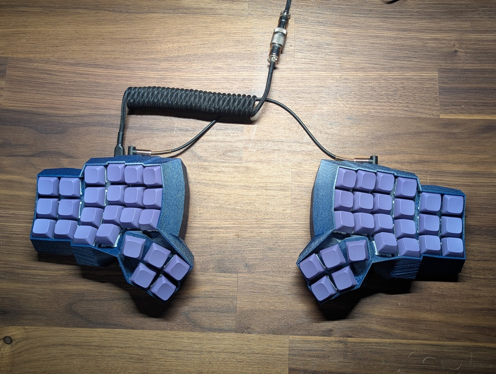
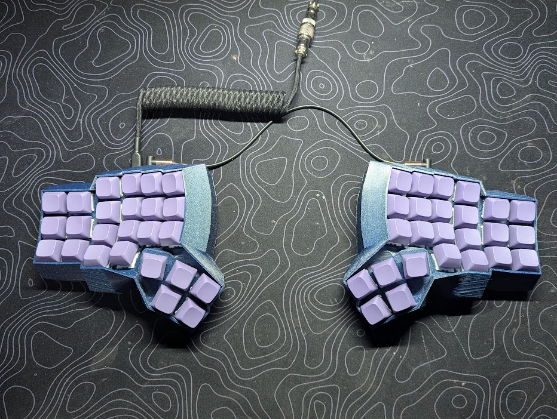

# Nebulon







## Design:

I used the Cosmos Keyboard Generator for this project. This build can be found [here](https://ryanis.cool/cosmos/beta#cm:CpMBChASBRCQQSATEgASADg7QIBGCg0SBRCQTSATEgASADgnChwSBxCQWSATQAISABIDELAvEgMQsF84E0CG8LwCChUSBRCQZSATEgASAxCwOxIDELBrOAAKExIFEJBxIBMSABIAOBRAioaKwAcKFxIEEBAgExIDEKBOEgIQMDgoQJSGirAHGABAsomgrtBfSNzwoqABCpIBChcSExDAwAJAgICQAkjCmaCVkLwBUEM4CAoVEhAQQECAgBhI0JWA3ZD1A1ALUJ4CChYSEhBAQICA1AJIwpmglZC8AVCGAVA6ChQSEBBAQICA8AFI5pn8p5ALUFdQfwoVEhAQQECAgKwDSPCZzLXQMFB0UJUBGAIiCgjIARDIARgAIABAy4uEpNAxSK2R3I3BkwYYhCAoZIIBAgQDWENoAA==).

Can also be found on the showcase at [this link](https://ryanis.cool/cosmos/showcase/69c774a8/) soon!

## Building

Unzip to qmk_firmware/keyboards
Make commands for this keyboard (after setting up your build environment):

```
    qmk compile -kb nebulon -km default
```

See the [build environment setup](https://docs.qmk.fm/#/getting_started_build_tools) and the [make instructions](https://docs.qmk.fm/#/getting_started_make_guide) for more information. Brand new to QMK? Start with our [Complete Newbs Guide](https://docs.qmk.fm/#/newbs).

## Modifying layout

This board has via enabled and layout can be modified through via.
Provided in the via directory is a `via.json` file. This is the design tab file so that this keyboard works in via. **It will not work without this file!**

Also provided in the via dir is `nebulon.layout.json` if you would like to use my current layout. Simply go to the [via website](https://usevia.app/#/) and upload the file for the board at the bottom in the save/upload layout section.
